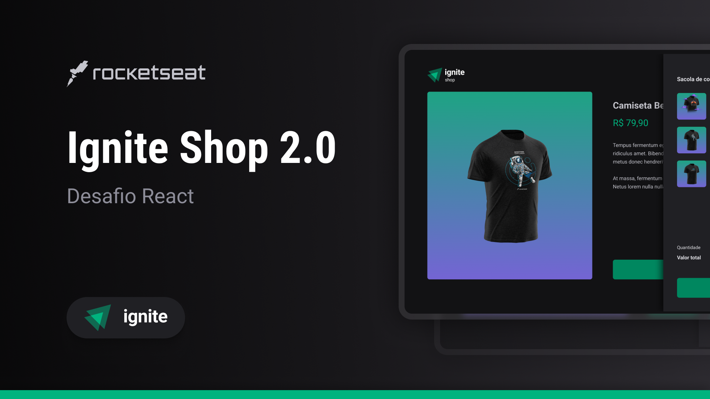

# Ignite-Shop

## Screen:

### Desafio Ignite Rocketseat. 🚀

Neste desafio foi desenvolvido um e-commerce, onde o usuário pode fazer a compra de camiseta, ser direcionado para uma página do Stripe para efetuar o pagamento e depois retornar para o site do projeto.

## Tools 🔧:

* [React](https://pt-br.reactjs.org/)
* [NextJS](https://nextjs.org/)
* [TypeScript](https://www.typescriptlang.org/)
* [Phosphoricons](https://phosphoricons.com/)
* [Tailwind](https://tailwindcss.com/)
* [Stripe](https://stripe.com/en-br)
* [BlurHash](https://blurha.sh/)
* [keenSlider](https://keen-slider.io/)
* [UseShoppingCart](https://useshoppingcart.com/)

---

### Access project:
`cd my-app`

### Install project:
`npm install`

### create file env.local and add your stripe key:
`STRIP_PUBLIC_KEY=******`
`STRIP_SECRET_KEY=******`

### Start project:
`npm run dev`
